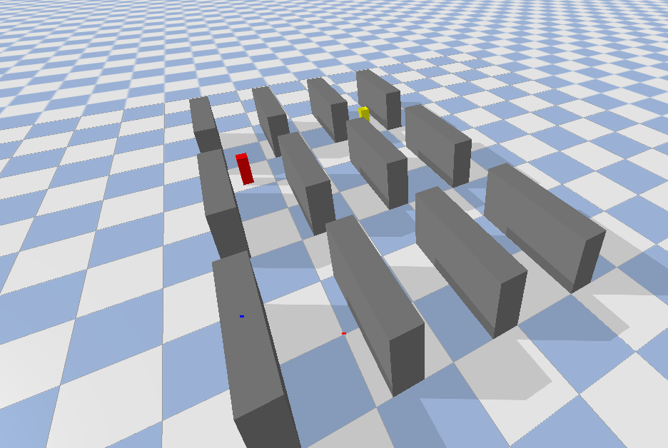

# READ ME

## Baseline

**file:** gym-pybullet-drones/gym_pybullet_drones/examples/RRT_trial.py

**objective:** Develop a baseline, which is a simple RRT

### week 4 - Baseline initial development

**how to run:**

Use the commond below to run the code:

```bash
python RRT_trial.py
```

I also added a debug configuration while I was trying to fix some problems, which I didn't manage to fix... but it can show the trees RRT explores, which probably would be useful in the future. So if you want to see the debug process, use the following command:

```bash
python RRT_trial.py --debug
```
*Reminder: the running time would be super long if you use debug.*

**Probelm:**

After some debugging, I found the problem is when the path recheaes the goal, the code gets stuck, more specifically, in function ```nearest_neighbor```. 

### week 5 - Baseline betterment

**Betterment 1 - edge collision check**

Added function ```edge_in_collision```, baseline RRT now performs planning with edge collision check.

**Betterment 2 - path smoothing**

Added function ```smooth_path```, it removes redundant points in the path that RRT found, resulting in a path that's more efficient.

The variable ```max_segment_length``` should be based on the dynamic constrains of the drone. If it's too big, the drone would crash for trying to move too fast.

However, the function now is using a very simple way to do path smoothing, there are other other options that can produce smooth path (see the table below). Whether we should implement path smoothing in the baseline is still to be discussed.

| **Method**              | **Pros**                                               | **Cons**                                        |
|--------------------------|-------------------------------------------------------|------------------------------------------------|
| Bézier Curve             | Smooth and visually appealing.                        | Does not pass through all waypoints.           |
| Catmull-Rom Splines      | Smooth and interpolates through waypoints.            | Computationally more intensive than Bézier.    |
| Moving Average           | Simple to implement and adjust.                      | Reduces path fidelity.                         |
| Shortcut Smoothing       | Simple and ensures feasibility.                      | May not produce the smoothest paths.           |
| Reparametrize Path       | Ensures constant velocity and smooth motion.          | Requires a pre-smoothed path.                  |

**Potential betterment - dynamic constrain check**

If it is posible, we can also added dynamic constrain check, so that we can avoid the drone moving so fast that it crashes.

I tried to look for the constrains of the drone in the original code, here is what I've found.

cf2p.urdf

| **Parameter**               | **Value**                               | **Description**                                   |
|-----------------------------|-----------------------------------------|-------------------------------------------------|
| `mass (m)`                  | 0.027 kg                               | Mass of the drone                               |
| `kf` (thrust coefficient)   | \( 3.16 \times 10^{-10} \)             | Converts RPMs into thrust                      |
| `km` (torque coefficient)   | \( 7.94 \times 10^{-12} \)             | Converts RPMs into torque                      |
| `thrust2weight`             | 2.25                                   | Thrust-to-weight ratio                         |
| `max_speed_kmh`             | 30 km/h (8.33 m/s)                     | Maximum horizontal speed                       |
| `prop_radius`               | 0.02313 m                              | Radius of the propeller                        |
| `drag_coeff_xy`             | \( 9.1785 \times 10^{-7} \)            | Drag coefficient in the X-Y plane             |
| `drag_coeff_z`              | \( 10.311 \times 10^{-7} \)            | Drag coefficient in the Z direction           |
| `dw_coeff_1`                | 2267.18                                | Downwash coefficient 1                         |
| `dw_coeff_2`                | 0.16                                   | Downwash coefficient 2                         |
| `dw_coeff_3`                | -0.11                                  | Downwash coefficient 3                         |
| `F_max` (Maximum Thrust)    | 0.595 N                                | Maximum thrust produced (based on thrust2weight)|
| `a_max` (Maximum Acceleration) | \( 22.04 \, \text{m/s}^2 \)         | Calculated maximum acceleration                |

cf2x.urdf (the one we're using)

| **Parameter**               | **Value**                               | **Description**                                   |
|-----------------------------|-----------------------------------------|-------------------------------------------------|
| `mass (m)`                  | 0.027 kg                               | Mass of the drone                               |
| `kf` (thrust coefficient)   | \( 3.16 \times 10^{-10} \)             | Converts RPMs into thrust                      |
| `km` (torque coefficient)   | \( 7.94 \times 10^{-12} \)             | Converts RPMs into torque                      |
| `thrust2weight`             | 2.25                                   | Thrust-to-weight ratio                         |
| `max_speed_kmh`             | 30 km/h (8.33 m/s)                     | Maximum horizontal speed                       |
| `prop_radius`               | 0.02313 m                              | Radius of the propeller                        |
| `drag_coeff_xy`             | \( 9.1785 \times 10^{-7} \)            | Drag coefficient in the X-Y plane             |
| `drag_coeff_z`              | \( 10.311 \times 10^{-7} \)            | Drag coefficient in the Z direction           |
| `dw_coeff_1`                | 2267.18                                | Downwash coefficient 1                         |
| `dw_coeff_2`                | 0.16                                   | Downwash coefficient 2                         |
| `dw_coeff_3`                | -0.11                                  | Downwash coefficient 3                         |
| `F_max` (Maximum Thrust)    | 0.595 N                                | Maximum thrust produced (based on thrust2weight)|
| `a_max` (Maximum Acceleration) | \( 22.04 \, \text{m/s}^2 \)         | Calculated maximum acceleration                |

racer.urdf

| **Parameter**               | **Value**                               | **Description**                                   |
|-----------------------------|-----------------------------------------|-------------------------------------------------|
| `mass (m)`                  | 0.830 kg                               | Mass of the drone                               |
| `kf` (thrust coefficient)   | \( 8.47 \times 10^{-9} \)              | Converts RPMs into thrust                      |
| `km` (torque coefficient)   | \( 2.13 \times 10^{-11} \)             | Converts RPMs into torque                      |
| `thrust2weight`             | 4.17                                   | Thrust-to-weight ratio                         |
| `max_speed_kmh`             | 200 km/h (55.56 m/s)                   | Maximum horizontal speed                       |
| `prop_radius`               | 0.127 m                                | Radius of the propeller                        |
| `drag_coeff_xy`             | \( 9.1785 \times 10^{-7} \)            | Drag coefficient in the X-Y plane             |
| `drag_coeff_z`              | \( 10.311 \times 10^{-7} \)            | Drag coefficient in the Z direction           |
| `dw_coeff_1`                | 2267.18                                | Downwash coefficient 1                         |
| `dw_coeff_2`                | 0.16                                   | Downwash coefficient 2                         |
| `dw_coeff_3`                | -0.11                                  | Downwash coefficient 3                         |
| `F_max` (Maximum Thrust)    | 33.84 N                                | Maximum thrust produced (based on thrust2weight)|
| `a_max` (Maximum Acceleration) | \( 40.77 \, \text{m/s}^2 \)         | Calculated maximum acceleration                |

## Warehouse Simulation Environment

### `WareHouse.py`

#### Purpose
Simulates a **detailed warehouse environment** with shelves and dynamic workers following fixed paths.

#### Features
1. **Static Shelves**
   - Dimensions: **Width: 0.4**, **Depth: 2.0**, **Height: 1.0**.
   - Arranged in rows with aisles and colored gray.

2. **Dynamic Workers**
   - Two workers with predefined, looped paths:
     - **Worker 1 (Red):** Navigates between the first and second aisle.
     - **Worker 2 (Yellow):** Navigates between the second and third aisle.
   - Collision-free paths with smooth movement.

3. **Key Methods**
   - `_add_warehouse_obstacles`: Creates the warehouse layout and initializes workers.
   - `update_dynamic_obstacles`: Updates worker positions along their paths.
   - `get_obstacles`: Returns a list of static and dynamic obstacles.

---

### `Environment.py`

#### Purpose
Provides a **basic warehouse setup** for simpler simulations or custom experiments.

#### Features
- **Static Shelves:** Same layout as `WareHouse.py`.
- **Dynamic Workers:** Simplified movement paths compared to `WareHouse.py`.

---

### Usage
- Use **`WareHouse.py`** for detailed simulations with dynamic worker paths.
- Use **`Environment.py`** for simpler setups or as a template for new simulations.
- **Customization:** Modify worker paths (`worker_paths`) or add obstacles in `_add_warehouse_obstacles`.

### Visualization
Below is an example of the warehouse environment:

